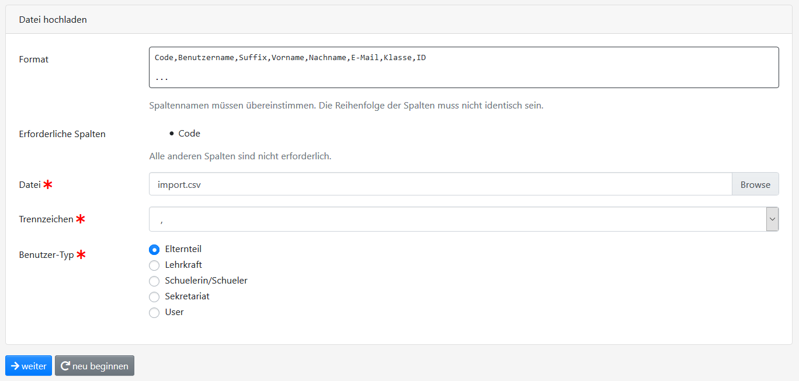
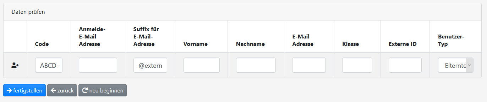

Registrierungscodes
===================

Vorbemerkung
############

Bei einem erneuten Import eines Registrierungscodes wird dieser aktualisiert. Für den Fall,
dass der Code bereits eingelöst wurde, werden die Änderungen zwar in der Datenbank hinterlegt,
aber da der Benutzer bereits angelegt wurde, wird dieser **nicht**  geändert.

CSV-Import
##########

Zunächst muss eine CSV-Datei mit den folgenden Spalten erzeugt werden:

.. code-block:: text

    Code,Benutzername,Suffix,Vorname,Nachname,E-Mail,Klasse,ID
    ABCD-EFG,,extern.example.com,,,,,

Erläuterungen:

- Die Felder Vorname, Nachname, Klasse, E-Mail und ID dürfen leer sein.
- Das Feld ID speichert eine ID, mit der der Benutzer an Diensten wie dem ICC "wiedererkannt" werden kann.
- Wenn weder Benutzername noch Suffix angegeben sind, kann sich der Benutzer eine beliebige Anmelde-E-Mail-Adresse zuweisen (sofern diese nicht bereits existiert). Hierbei wird der Konfigurationsparameter ``REGISTRATION_DOMAIN_BLOCKLIST`` berücksicht.
- Die Reihenfolge der Spalten ist beliebig.

Den Import startet man in der Verwaltung der Registrierungscodes :fa:`qr-code` über den Button :fa:`upload` Registrierungscodes importieren.
Dort wählt man zunächst die CSV-Datei aus. Anschließend überprüft man, ob das Trennzeichen (, oder ;) passt.
Zum Schluss wählt man noch aus, welchem Benutzertyp die den Benutzern des Registrierungscodes zugewiesen werden sollen.

Nun überprüft man die Daten, ändert sie ggf. ab und klickt auf :fa:`arrow-right` fertigstellen.

API-Import
##########

Über die `REST-Schnittstelle <https://de.wikipedia.org/wiki/Representational_State_Transfer>`_ können Benutzer
automatisiert angelegt werden. 

Die Dokumentation der Schnittstelle ist in der Verwaltung :fa:`cogs` unter *API-Dokumentation* angegeben.

Zur Nutzung der API bitte unter `API-Schnittstelle <../api/index.html>`_ weiterlesen.