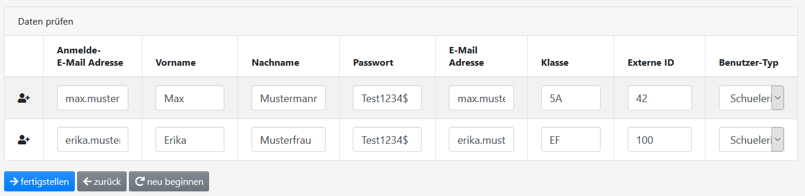
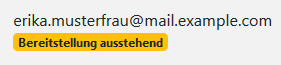

Benutzer
========

Vorbemerkungen
##############

Beim Import müssen folgende Dinge beachtet werden:

- Importiert man vorhandene Benutzer erneut, werden diese entsprechend der neuen Daten aktualisiert. Passwörter werden dabei **nicht** überschrieben, sondern ignoriert.
- Das System erkennt vorhandene Benutzer anhand der E-Mail-Adresse.
- Wenn beim Import kein Passwort angegeben wird, muss der Benutzer die *Passwort zurücksetzen*-Funktion verwenden, um sich ein Passwort zu setzen. **Wichtig:** Die E-Mail-Adresse muss gültig sein und E-Mails vom System empfangen können!

CSV-Import
##########

Zunächst muss eine CSV-Datei mit den folgenden Spalten erzeugt werden:

.. code-block:: text

    E-Mail,Passwort,Vorname,Nachname,Klasse,ID
    max.mustermann@mail.example.com,Test1234$,Max,Mustermann,5A,42
    erika.musterfrau@mail.example.com,Test1234$,Erika,Musterfrau,EF,100

Erläuterungen:

- Die Felder Passwort, Vorname, Nachname, Klasse und ID dürfen leer sein.
- Das Feld ID speichert eine ID, mit der der Benutzer an Diensten wie dem ICC "wiedererkannt" werden kann.
- Die E-Mail-Adresse ist gleichzeitig auch die Anmelde-E-Mail-Adresse.
- Die Reihenfolge der Spalten ist beliebig.

Den Import startet man in der Benutzerverwaltung :fa:`users` über den Button :fa:`upload` Benutzer importieren.
Dort wählt man zunächst die CSV-Datei aus. Anschließend überprüft man, ob das Trennzeichen (, oder ;) passt.
Zum Schluss wählt man noch aus, welchem Benutzertyp die importieren Benutzer zugewiesen werden sollen.

.. image:: ../images/import/users/csv-1.png

Nun überprüft man die Daten, ändert sie ggf. ab und klickt auf :fa:`arrow-right` fertigstellen.

.. warning:: Nach dem CSV-Import dauert es eine Weile, bis die Benutzer provisioniert wurden. Da das Hashen der Passwörter Zeit in Anspruch nimmt, wird diese Aufgabe von einer Hintergrundaufgabe erledigt.

Man erkennt noch nicht bereitgestellte Benutzer am Tag *Bereitstellung ausstehend*:

Sobald das Tag verschwunden ist, kann sich der Benutzer anmelden.

API-Import
##########

Über die `REST-Schnittstelle <https://de.wikipedia.org/wiki/Representational_State_Transfer>`_ können Benutzer
automatisiert angelegt werden. 

Die Dokumentation der Schnittstelle ist in der Verwaltung :fa:`cogs` unter *API-Dokumentation* angegeben.

Zur Nutzung der API bitte unter `API-Schnittstelle <../api/index.html>`_ weiterlesen.